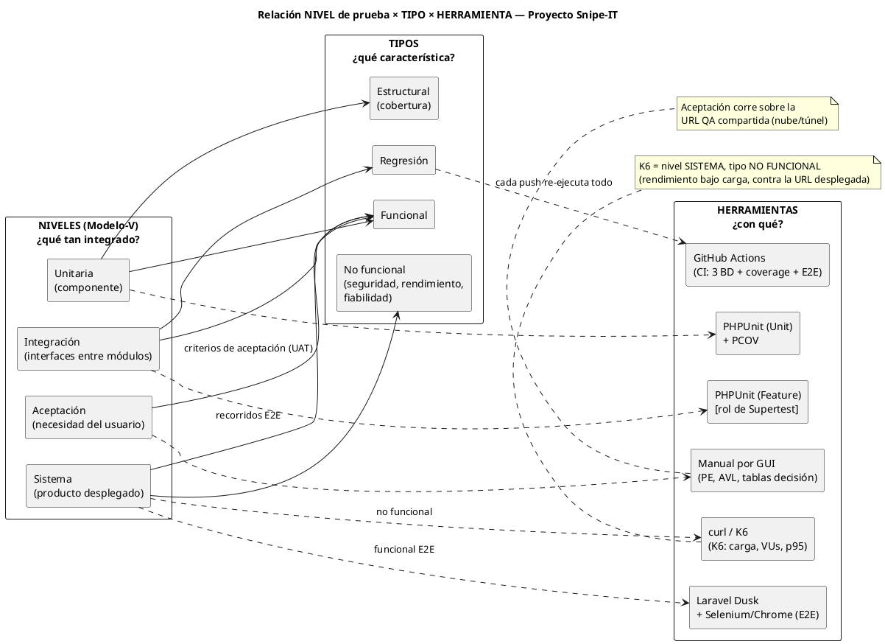

# Alineación con la bibliografía del curso — Niveles × Tipos × Herramientas

> Contraste entre la bibliografía indicada por el docente y nuestro proceso de pruebas sobre Snipe-IT, para verificar si el plan **va bien o se desvía**. Fecha: 2026-07-09.
>
> Bibliografía revisada:
> - **A. Spillner — "Software Testing Foundations", cap. *Dynamic Testing*** (base del temario ISTQB).
> - **G. J. Myers — "The Art of Software Testing", cap. *Module (Unit) Testing***.

---

## 1. Qué dice la bibliografía (síntesis aplicada)

### 1.1 Spillner — Dynamic Testing

**Pruebas dinámicas** = las que **ejecutan** el software con datos de prueba (a diferencia de las estáticas: revisiones, análisis de código). Spillner organiza el testing dinámico en **tres dimensiones ortogonales** — esta es la clave conceptual que pide el profesor:

| Dimensión | Qué responde | Valores |
|---|---|---|
| **NIVEL** (test level) | ¿*Qué tan integrado* está lo que pruebo? (Modelo-V) | Componente/Unitaria → Integración → Sistema → Aceptación |
| **TIPO** (test type) | ¿*Qué característica* pruebo? | Funcional · No funcional (rendimiento, seguridad, fiabilidad…) · Estructural (cobertura) · Relacionadas al cambio (regresión/confirmación) |
| **TÉCNICA** (test technique) | ¿*Cómo diseño* los casos? | Caja negra (particiones de equivalencia **PE**, análisis de valores límite **AVL**, tablas de decisión, transición de estados) · Caja blanca (cobertura de sentencias/ramas) · Basadas en experiencia (exploratorias, error guessing) |

**Relación (lo que suele confundirse):** los tipos y técnicas **NO pertenecen a un nivel** — se **cruzan**. En *cada* nivel puedes aplicar pruebas funcionales y no funcionales, con técnicas de caja negra o blanca. Ej.: hay pruebas funcionales unitarias *y* funcionales de sistema; hay caja negra en unitarias (contra la especificación del método) *y* en sistema (contra los requisitos).

### 1.2 Myers — Module (Unit) Testing

- La prueba de módulo se diseña **combinando** caja blanca (cobertura lógica del código) **y** caja negra (contra la **especificación** del módulo).
- Integración **incremental** (no *big bang*), con **stubs** (sustituyen módulos llamados) y **drivers** (sustituyen a quien llama).
- **Mentalidad destructiva:** una buena prueba es la que tiene alta probabilidad de **encontrar un defecto**, no la que confirma que "funciona".
- Riesgo de que **el autor pruebe su propio código** (sesgo de confirmación).

---

## 2. ¿Vamos bien o nos estamos desviando? (contraste punto por punto)

| Concepto de la bibliografía | Nuestro proyecto | Veredicto |
|---|---|---|
| Niveles del Modelo-V completos | Unitaria ✅ (85 % cobertura) · Integración ✅ (24 casos propios) · Sistema 🟡 (NF 4/4; E2E en estabilización) · Aceptación ❌ (sin documentos) | 🟡 Alineado, con Aceptación pendiente |
| Tipos: funcional | CPF caja negra manual (Hito 2) + suites automatizadas | ✅ |
| Tipos: estructural (cobertura) | PCOV, 85 % líneas en Unit | ✅ |
| Tipos: regresión | CI en cada push (3 motores de BD) + regresión de 140 tests tras el fix INC-02 | ✅ |
| Tipos: **no funcional** | Seguridad/fiabilidad con HTTP real ✅ · **Rendimiento medido con `curl` (puntual)** — el docente señala **K6** | ⚠️ **Brecha: adoptar K6** |
| Técnicas caja negra (PE, AVL…) | CPF-06 usa **AVL/PE de libro**: seats = 0 / 1 / 10 / 10 000 / 100 000 (límites de `min:1` y `limit_change:10000`) | ✅ (conviene **nombrar la técnica** explícitamente en los documentos) |
| Técnicas caja blanca | Cobertura por ramas en unitarias (matrices de payloads, ramas de validación) | ✅ |
| Myers: stubs y drivers | Documentado en el Plan de Integración: **factories = drivers**, `Mail::fake()`/`Event::fake()` = **stubs** | ✅ |
| Myers: integración incremental, no big bang | Estrategia Bottom-Up por subsistema (Plan §3) | ✅ |
| Myers: mentalidad destructiva | **Inyección de fallas FI-01/02/03** → encontró el **defecto real INC-02** (fecha de devolución anterior a la entrega) | ✅ ejemplar |
| Myers: el autor no debe probar su propio código | INC-01: un test del grupo asumía mal el comportamiento de otro subsistema (evento/listener) — ilustra el sesgo | ✅ documentado |
| **E2E** (mención del docente) | Dusk + Selenium implementado (tests/Browser, CI) — corrida verde pendiente | 🟡 |

**Veredicto global: NO estamos desviados.** La estructura (niveles × tipos × técnicas), la estrategia de integración y la mentalidad de diseño de casos coinciden con Spillner y Myers. Hay **dos brechas concretas**:
1. **K6** — el docente lo menciona y nuestro rendimiento se midió con `curl` (tomas puntuales, sin carga concurrente). K6 añade lo que falta: **usuarios virtuales (VUs), duración, percentiles y umbrales** (`thresholds`). Acción: script K6 contra la URL desplegada para NF-PERF-01/02.
2. **Aceptación** — único nivel sin Plan/Informe (ya identificado en la ruta crítica).

---

## 3. K6 en nuestro contexto (qué es y dónde encaja)

- **Qué es:** herramienta open source (Grafana) de **pruebas de carga/rendimiento**: scripts en JavaScript que simulan N usuarios virtuales golpeando endpoints HTTP, con métricas (p95, req/s, errores) y **umbrales que hacen fallar la prueba** si no se cumplen.
- **Dónde encaja:** **nivel Sistema · tipo No funcional (eficiencia/rendimiento) · caja negra** — corre contra la **URL desplegada** (Docker local o nube), no contra el código.
- **Ejemplo mínimo para Snipe-IT** (reemplaza las tomas de `curl` de NF-PERF-01):

```javascript
// k6-login.js  →  ejecutar: k6 run k6-login.js
import http from 'k6/http';
import { check } from 'k6';

export const options = {
  vus: 10,                 // 10 usuarios virtuales concurrentes
  duration: '30s',
  thresholds: {
    http_req_duration: ['p(95)<2000'],  // NF-PERF-01: p95 < 2 s
    http_req_failed: ['rate<0.01'],     // < 1 % de errores
  },
};

export default function () {
  const res = http.get('http://localhost:8000/login');
  check(res, { 'status 200': (r) => r.status === 200 });
}
```

---

## 4. Tabla resumen — NIVEL × TIPO × TÉCNICA × HERRAMIENTA (nuestro proyecto)

| Nivel (Modelo-V) | Tipo(s) aplicados | Técnica | Herramienta usada | Entorno | Estado |
|---|---|---|---|---|---|
| **Unitaria** (DEV) | Funcional + Estructural (cobertura) | Caja blanca + caja negra del método | **PHPUnit (Unit) + PCOV** | Proceso PHP, SQLite `:memory:` | ✅ 85 % |
| **Integración** | Funcional + Regresión + Negativa (fallas de interfaz) | Caja gris (HTTP + estado en BD); drivers=factories, stubs=fakes | **PHPUnit (Feature)** — rol de Supertest en PHP | Runner Docker `test`/`test-mysql` | ✅ 24 casos propios |
| **Sistema — funcional E2E** | Funcional (recorridos de negocio) | Caja negra por UI | **Laravel Dusk + Selenium/Chrome** — rol de Cypress/Playwright | App desplegada (Docker/CI) | 🟡 estabilización |
| **Sistema — no funcional** | Seguridad · Fiabilidad · **Rendimiento** | Caja negra sobre HTTP | `curl` (estados/cabeceras/TTFB) + **K6 (carga: VUs, p95, umbrales)** ← *por adoptar* | App desplegada (Docker/nube) | 🟡 4/4 con curl; K6 pendiente |
| **Aceptación (UAT)** | Funcional (criterios de aceptación por RF) | Caja negra manual (PE, AVL, transición de estados) | **Manual por GUI** (CPF formalizados como criterios UAT) | **URL compartida en nube** (Railway / túnel) | ❌ por documentar |
| *(transversal)* Regresión | Todas las suites re-ejecutadas en cada push | — | **GitHub Actions** (3 motores BD + coverage + E2E) | CI (nube) | ✅ |

---

## 5. Gráfico (código PlantUML)



> Para renderizarlo: pegar el bloque en https://www.plantuml.com/plantuml o en la extensión PlantUML de VS Code. La Wiki de GitHub no renderiza PlantUML nativo: exportar como PNG e insertarlo.

---

## 6. Acciones derivadas (para no desviarnos)

1. **Adoptar K6** para NF-PERF-01/02 (script §3) sobre la URL desplegada → actualizar Informe de Sistema (sustituye/complementa las tomas de `curl`).
2. **Crear Plan + Informe de Aceptación** (UAT) reutilizando los CPF como criterios de aceptación, ejecutados sobre la URL QA compartida.
3. **Nombrar explícitamente las técnicas** (PE, AVL, transición de estados) en el Diseño de Casos Funcionales y en el artículo IEEE — ya las aplicamos (p. ej. seats 0/1/10/10000/100000), solo falta etiquetarlas con el vocabulario de Spillner.
4. Citar en el artículo IEEE: Spillner (Dynamic Testing) para la matriz nivel×tipo×técnica, y Myers (Module Testing) para stubs/drivers, integración incremental y mentalidad destructiva (evidenciada por INC-02).

---

*Alineación bibliográfica — Hito 3–4. Curso de Pruebas de Software.*
